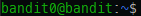

To start off my writeups I decided to do the first game I ever did, which was the Overthewire's Bandit.
This game is a more beginner friendly intro to what labs/games are and what you can expect.

Basically for a person who never did a wargame on Overthewire, the objective is completing levels.
Each level is a user in the machine we are connecting to, and completing the challenge on that user grants
the password for the next user and so on.

Remember that if you want to really learn what these games want to teach you, the best thing to do is do them
blindly (without reading a writeup like this one) and research on the internet the topics presented, not the
solutions. With that in mind, writeups (for me atleast) are just a way of seeing other ways to accomplish the same
solution, which you might have not thought of.

With all that out of the way, let's start.

## Level 0

This level is the intro to the game and teaches what you need to do to connect to the remote machine. We will use
a protocol called SSH to do our connection. Each level has reading material on the topics it is talking about so
if you don't know about SSH I recommend checking out, but basically SSH is a protocol for remote and secure connections to another machine.

The basic syntax is:

```sh
ssh {user}@{host} -p {port}
```

So for our purposes of connecting to the host bandit.labs.overthewire.org at port 2220 with the user bandit0 the command will be:

```sh
ssh bandit0@bandit.labs.overthewire.org -p 2220
```

If whoever you are using Windows you can install a program called putty, on this [link](https://www.putty.org/).

Then on the putty window you can put the same informations, like in this image:


After that the description tells us that the password for bandit0 is bandit0, so login and you should get a shell on the remote machine.

## Level 0 -> 1

The description of this level says that the password is stored in a file called readme on the home directory of the user.

So, when you log in to bandit0 you should see a ~, that means we are on the home directory of the user bandit0, like this:



Since we are already on the home folder of the user, all we need to do is run the command:

```sh
ls -l
```

So we can list all the files within the directory. The -l is to present the files in a list format, showing more details. 
From left to right we can see the file permissions, the first r and w means that the creator of the file can read and write, the second r means that bandit0 can read the file, then we have the user that created, which is bandit1 and the group that can read it, which in this case is bandit0.
Lastly we have the date it was last edited and the name of the file, which is "readme".

So, this is the file we want. To read a file you can use the command:

```sh
cat {file}
```

Using this command to read the readme file we get our password, *boJ9jbbUNNfktd78OOpsqOltutMc3MY1*.

##Level 1 -> 2